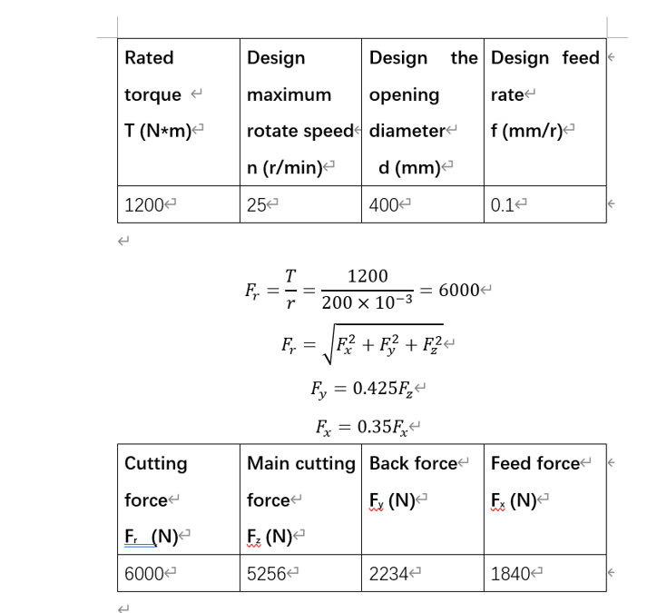
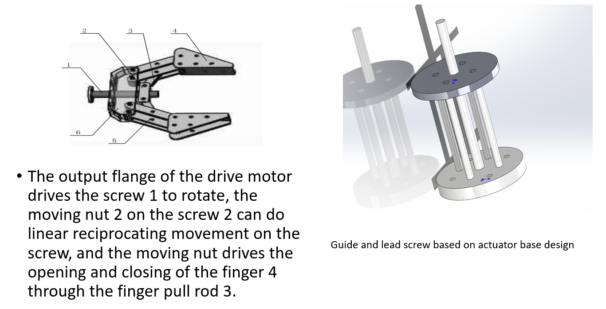
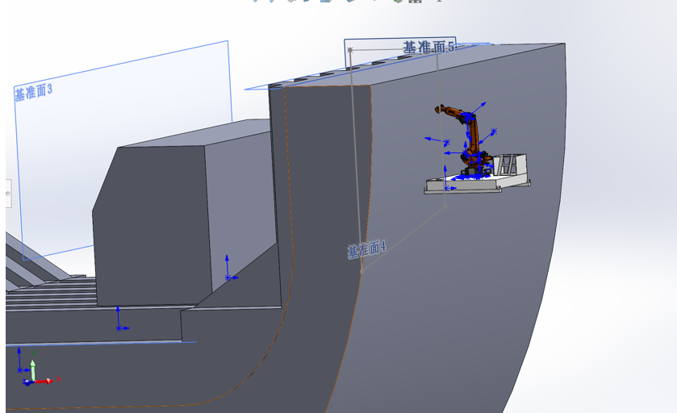
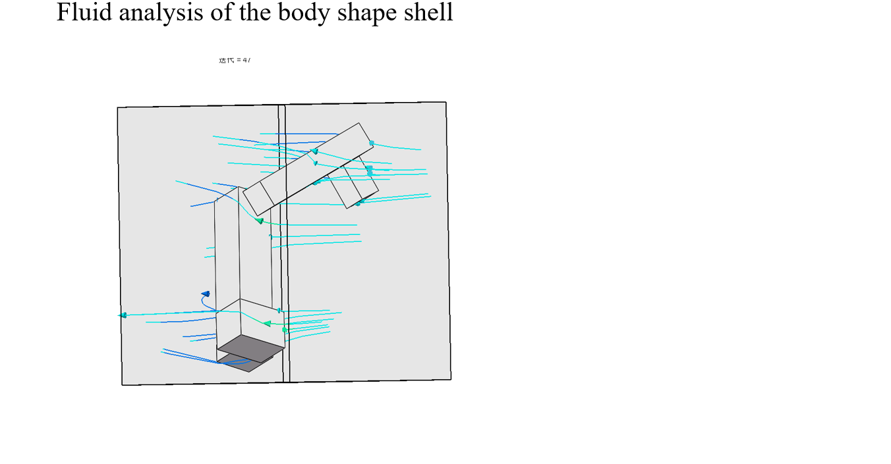
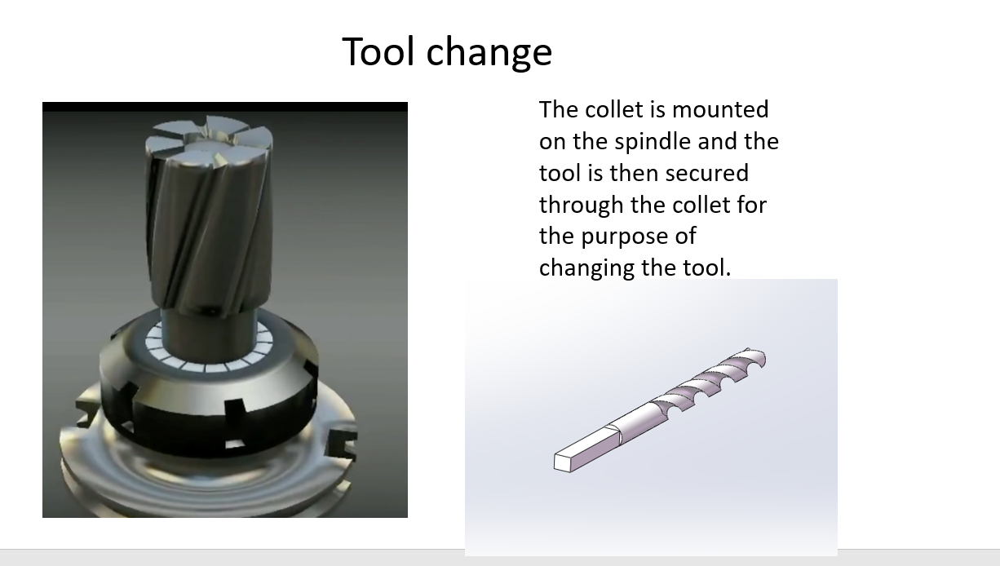

Diver work
Tenth Week Schedule
The group held a meeting at 1:30 p.m. on 3 November. This week we optimized the details of the project design and discussed each section with our mentor.
1. ** Opening Equipment: ** This week I mainly analyzed the cutting force situation, is expected to need 3 kW power of the motor, considering that the volume of the motor may be too large, so the need to replace the power source.

2. ** Robotic Arm End-effector** The output flange of the drive motor drives the screw 1 to rotate, the moving nut 2 on the screw 2 can do linear reciprocating movement on the screw, and the moving nut drives the opening and closing of the finger 4 through the finger pull rod 3.

3. **Analysis of motion planning of mechanical arm ** The hull length is set to 15m and the bottom width is set to 10m

4. **Profile Design** Fluid analysis of the motion state of joint 2,3 at a 2m/s velocity in the y direction when rotated 90 degrees.

5. **Equipment Automation**
The collet is mounted on the spindle and the tool is then secured through the collet for the purpose of changing the tool.

