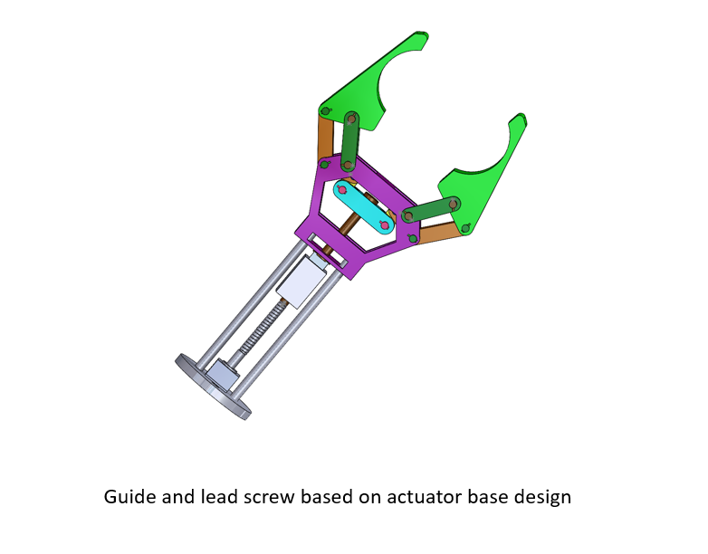

Diver work
Eleventh Week Schedule
The group held a meeting at 1:30 p.m. on 10 November. This week, the team made and modified the defense ppt and discussed the project details with the tutor.
1. ** Opening Equipment: ** This week I mainly I mainly made the guide rail for fixing the equipment in the tool box and the connecting device for the manipulator to grasp.

2. ** Robotic Arm End-effector** The output flange of the drive motor drives the screw 1 to rotate, the moving nut 2 on the screw 2 can do linear reciprocating movement on the screw, and the moving nut drives the opening and closing of the finger 4 through the finger pull rod 3.

3. **Analysis of motion planning of mechanical arm ** The robot arm is located in the center of the base, and the toolbox and counterweight are symmetrical relative to the center of the base

4. **Profile Design** Theoretical analysis stage.

5. **Equipment Automation**
Open point identification in three directions

