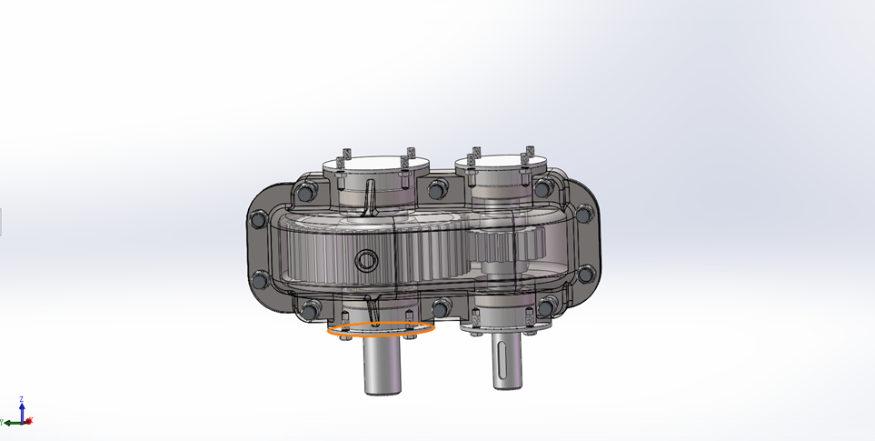

Diver work
Eighth Week Schedule
The group held a meeting at 1:30 p.m. on 20 October. This week we optimized the details of the project design and discussed each section with our mentor.
1. ** Opening Equipment: ** The reducer is redesigned and the stress of the blade is analyzed.

2. ** Robotic Arm End-effector** Stepper motor is a kind of motor that converts the electrical pulse signal into the corresponding angular displacement or linear displacement. With each input pulse, the rotor turns at an Angle or further forward.

3. **Analysis of motion planning of mechanical arm ** Force analysis was carried out on the thickened base, and the same force was applied, and it was found that the strength of the material was qualified and the force was concentrated at the lifting point

4. **Profile Design** Fluid analysis of the motion state of joint 2,3 at a 2m/s velocity in the y direction when rotated 90 degrees.

5. **Equipment Automation**
1)Punching and positioning using a positioning device
2)Screening for compliant opening locations
3)Rotation of hole-opening equipment using a robotic arm
4)Opening of holes using a milling cutter

