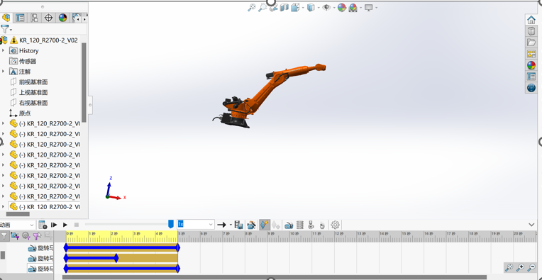

Diver work
Ninth Week Schedule
The group held a meeting at 1:30 p.m. on 27 October. This week we optimized the details of the project design and discussed each section with our mentor.
1. ** Opening Equipment: ** This week I spliced the gear and equipment together and updated the design of the equipment.

2. ** Robotic Arm End-effector** In the structural design of the hand claw, the mechanism is simple to facilitate expansion and installation, and the light weight is to improve the load capacity of the mechanical arm, thereby improving the working efficiency of the entire mechanical arm.

3. **Analysis of motion planning of mechanical arm ** A rotating motor is provided for the three elbow joints of the manipulator to demonstrate the rotation from the initial position to the specified position

4. **Profile Design** This week, I mainly updated the calculation code and optimized the calculation method.

5. **Equipment Automation**
This week I mainly determined the method of analyzing the image, and the method of determining the position of the opening.

